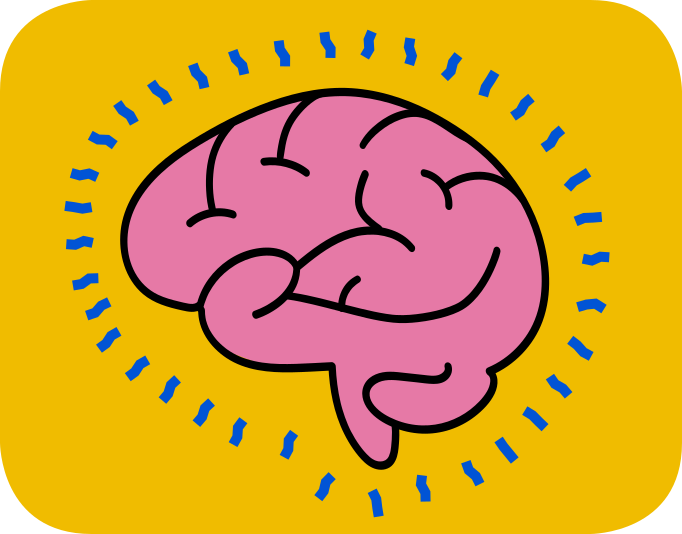

# 🧭 Curious AInough: Elevate Your Thinking

*A practical guide to learning, creating, and making decisions with AI.*

Artificial intelligence is here to stay, whether we like it or not. That's a reason to act. With all the uncertainty life brings, the best thing you can do is elevate your thinking—something no one can take away from you. If you're curious AInough, [start here](01-start-here/README.md) and see where it takes you.

## 🔁 The five-step loop

**Define the goal → Give context → Explore → Check → Decide**

## 📖 Table of contents

| # | Section | What it covers |
| --- | --- | --- |
| 1 | [🧭 Start Here: Stay in the Driver's Seat](01-start-here/README.md) | The mindset, the five-step loop, a one-page cheat sheet |
| 2 | [🗣️ Prompting & Context](02-prompting-and-context/README.md) | How to ask for what you actually need |
| 3 | [🎓 Learning With AI](03-learning-with-ai/README.md) | Using AI as a coach instead of an answer machine |
| 4 | [🔍 Research & Verification](04-research-and-verification/README.md) | Following evidence, not confident-sounding claims |
| 5 | [💡 Brainstorming & Curiosity](05-brainstorming-and-curiosity/README.md) | Developing and stress-testing your own ideas |
| 6 | [🔐 Ethics, Privacy & Security](06-ethics-privacy-security/README.md) | Protecting data and working fairly |
| 7 | [⚙️ Creating & Automation](07-creating-and-automation/README.md) | Turning repetitive work into a reviewed process |
| 8 | [🤖 Coding With Agents](08-coding-with-agents/README.md) | Working safely with AI coding agents |
| 9 | [🧠 Large Language Models](09-large-language-models/README.md) | How LLMs, tools, MCP, and agents work together |
| 10 | [🧰 Tool Directory](10-tool-directory/README.md) | Current student offers and free tiers |

## 🔗 Further reading

- [🔗 Official Resources & Further Reading](official-resources.md): outside links on how AI works, learning frameworks, and official student-offer documentation.
